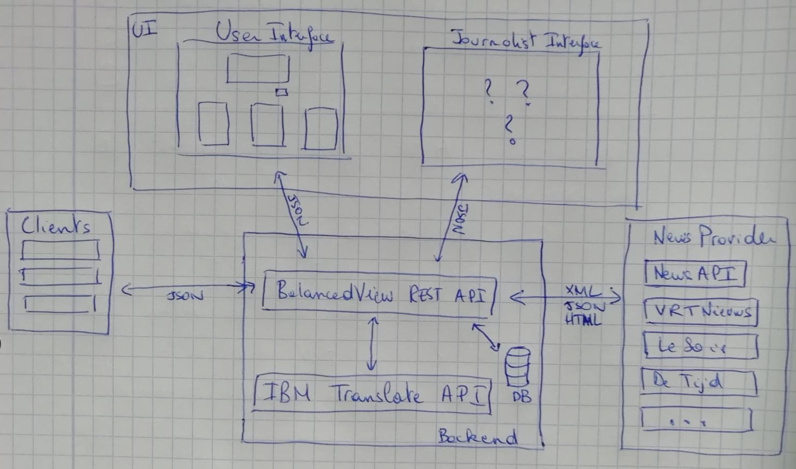

# BalancedView

The app is deployed with Heroku [here](https://fact-checker.herokuapp.com/).

Authors: [Quentin Meeus](https://github.com/qmeeus) & [Calum Thornhill](https://github.com/cjthornhill) 

Active developer: [Quentin Meeus](https://github.com/qmeeus)

This tool started as a project for the course Knowledge and the Web of the Master in Artificial Intelligence of KU Leuven. It is now part of the DIAMOND (Diversity and Information Media: New Tools for a Multifaceted Public Debate) workgroup in collaboration with the universities of Leuven, Antwerpen and Brussels. 

This tool aims to inform the public and interested parties (including journalists) about how a specific fact or event has been covered in the media. It is an attempt to educate online users about fake news and misinformation. It is also an easy way to quickly check whether a fact is real or not.

A paper was published in June 2019 under the name "A Digital Nudge to Counter Confirmation Bias". The publication is available [here](https://github.com/qmeeus/balanced-view/blob/master/documents/Digital_Nudge.pdf).

The authors would like to thank Bettina Berendt and Jeroen Pepperkamp for their help and advices since the early stages of development and for their major role in the writing and proof-reading of the paper.

## Citations
If you find this tool or the publication useful for your research project, please include this citation in your work:

```
@article{10.3389/fdata.2019.00011,
  author    =  {Thornhill, Calum and Meeus, Quentin and Peperkamp, Jeroen and Berendt, Bettina}, 
  title     =  {A Digital Nudge to Counter Confirmation Bias},
  journal   =  {Frontiers in Big Data},
  volume    =  {2},
  pages     =  {11},
  year      =  {2019},
  url       =  {https://www.frontiersin.org/article/10.3389/fdata.2019.00011},
  doi       =  {10.3389/fdata.2019.00011},
  issn      =  {2624-909X},
  abstract  =  {Fake news is an increasing issue on social media platforms. In this work, rather than detect misinformation, we propose the use of nudges to help steer internet users into fact checking the news they read online. We discuss two types of nudging strategies, by presentation and by information. We present the tool BalancedView, a proof-of-concept that shows news stories relevant to a tweet. The method presents the user with a selection of articles from a range of reputable news sources providing alternative opinions from the whole political spectrum, with these alternative articles identified as matching the original one by a combination of natural language processing and search. The results of an initial user study of BalancedView show that nudging by information may change the behaviour of users towards that of informed news readers.}
}
```

## TODO - Project Plan
 - Decoupling services with Kubernetes and docker-compose
   - CI/CD (Continuous integration / continuous deployment)
   - Structure (see schema):
     - User Interface (receive input and display response)
     - REST API for BalancedView service (json with input and language -> curated selection of articles)
     - Translate API (provided by IBM)
     - Journalist Interface (adapted to the specific needs of news reporters)
   - Questions:
     - Hosting? (a.t.m. Heroku with the advantages and disadvantages, possible @KUL? AWS?)
     - What about domain name?
     - How to make the site faster? Is it slow because of Heroku?
 - Check dutch parsing (and improve if needed)
 - Translate the website and option to switch languages
 - Connect to belgian (nl-fr) news providers
   - Catgories of news provider - do the current categories still make sense?
   - Which news provider provides a developer API?
   - Are there fees to pay?
   - What can we scrape without risk of infringing IP laws?
 - IBM Translation service
 - Multilingual support (provide translated articles from other languages)
 - Matching algorithm:
   - Move from TextRank to Deep Learning (Graph Convolutional Nets, Bi-LSTM?)
   - Latest developments in NLP (Attention is all you need)
   - Strategy: training data / unsupervised learning / train and host vs continuous learning
 - Connect DB and store searches?
   - If yes: requirements > GDPR?
 - Develop journalist interface (needs input from the concerned parties)



## Notes for developers
**Please note that this project is under the GNU General Public License, which authorises you to do pretty much anything with the code except changing the license. In other words, feel free to clone it, transform it or improve it as much as you want, but you can't make it private: it has to remain open source.**

The repository is organised as follow:
 - `/` all the files that have to do with deploying the website, including docker configuration files and various scripts to launch and deploy the app
 - `/app` the code of the website
 - `/app/index.py` the website logic which formulates the logic behind user interactions
 - `/app/api` the code to summarise text and query the news api + the data used for the sources
 - `/app/templates` the various templates of the static webpages
 - `/app/static` static files including css and js libraries used in the webpages

## Requirements
- docker (yup that's it !)

## How to build and deploy locally?
1. First build the container. From the project root, run this:<br/>
`docker build -t python3-flask -f Dockerfile.dev --build-arg user_id=$(id -u) .`

2. Launch the container in deamon mode: <br/>
`docker run -d --name fact-checker -p 5000:5000 -v $(pwd):/home/patrick/src python3-flask`

3. Navigate to [http://localhost:5000](http://localhost:5000)

4. Check the logs:<br/>
`docker logs -f fact-checker`

5. Command-line debugging of the container: <br/>
`docker exec -it fact-checker bash`


**NB**: Tested on Linux, should be similar on all UNIX-like systems equiped with Docker. For Windows 
you probably need to replace `$(id -u)` 
with any number >= 1000. Also, if like me you're using fish shell you probably want to remove the `$` sign in front of the variables<br/><br/>