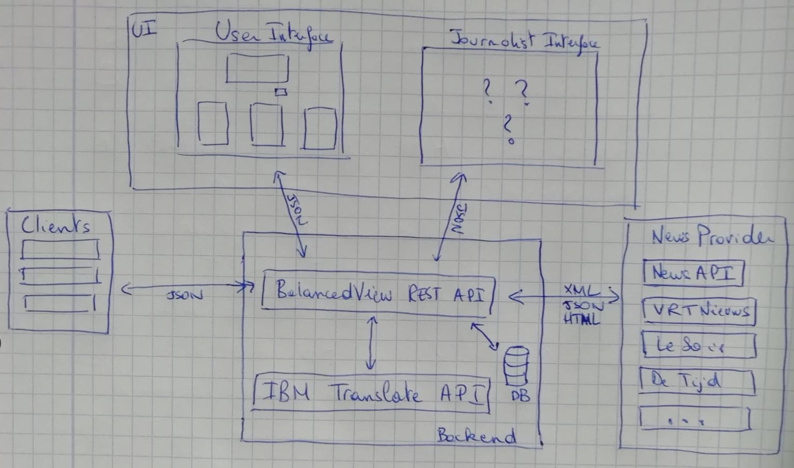

# BalancedView

## Introduction

### Short history of the project
BalancedView was initiated by Quentin Meeus and Calum Thornhill in the fall of 2018. The first iteration (a proof of concept really) was concluded by a paper (referenced below). Quentin Meeus took this project to the next level by switching the focus from the U.S. to Europe, and in particular, Belgium and making it scalable. This iteration also marked the inclusion of the project into [DIAMOND](https://soc.kuleuven.be/fsw/diamond). The second iteration ended with a workshop and user test to validate the conceptual and functional foundations. The next iteration will be taken over by Özgür Karadeniz and the project moves [there](https://github.com/okaradeniz/balanced-view).

### Background
Fake news spread faster and further on the web than cholera in a glass of water. Of course, the manipulation of information is not something new and is mastered by dictatorial regimes and shady political persons for ages. What makes it more of a problem now than at any other time in History then? Well in this Internet age, the amount of information that each of us is exposed to each day is staggering, whether it comes from news media, blogs, forums, Facebook, Instagram or Google. Anyone can share anything without control whatsoever. Obviously, this has advantages in terms of freedom of speech, but it also means that it is much more complicated to verify each piece of information.

Some social networks and NGO's started to look into the problem, trying to detect false information as it is published or shared. Generally, the approach taken requires experts and journalists to fact check each piece of information manually and flag news articles as "fake" by the means of a sticker. In the literature, this is what is called a nudge by information. The idea is to control the spreading of incorrect information by letting the user know that a given article probably contains dubious or incorrect statements. The approach chosen in BalancedView is more of an educational one, where the user is encouraged to research and assess by himself the quality of articles found online. This is referred to as a nudge by presentation. This choice is motivated by the so-called "confirmation bias" effect, according to which one accepts more easily arguments aligned with one's beliefs rather than arguments that contradicts them. Further, we think that it is imperative that people start to question everything that is read online and learn how not to fall into passively absorbing information without verifying its validity.

> "It ain't what you don't know that gets you into trouble. It's what you know for sure that just ain't so."
> Mark Twain

For more information about nudges, confirmation bias and the other vicious effects that all contributes to the spread of misinformation online, please refer to [our paper](documents/Digital_Nudge.pdf). The remaining of this document is divided into 3 sections: first a brief overview of the tool, including a word about the design choices, the technical specifications of the tool as well as the motivation behind technical choices and finally a section about future developments, with the learnings and recommendations obtained through a user test.

### Citation
If you find this project useful for your research, please cite us:
```
@article{10.3389/fdata.2019.00011,
  author    =  {Thornhill, Calum and Meeus, Quentin and Peperkamp, Jeroen and Berendt, Bettina}, 
  title     =  {A Digital Nudge to Counter Confirmation Bias},
  journal   =  {Frontiers in Big Data},
  volume    =  {2},
  pages     =  {11},
  year      =  {2019},
  url       =  {https://doi.org/10.3389/fdata.2019.00011},
  doi       =  {10.3389/fdata.2019.00011},
  issn      =  {2624-909X},
  abstract  =  {Fake news is an increasing issue on social media platforms. In this work, rather than detect misinformation, we propose the use of nudges to help steer internet users into fact checking the news they read online. We discuss two types of nudging strategies, by presentation and by information. We present the tool BalancedView, a proof-of-concept that shows news stories relevant to a tweet. The method presents the user with a selection of articles from a range of reputable news sources providing alternative opinions from the whole political spectrum, with these alternative articles identified as matching the original one by a combination of natural language processing and search. The results of an initial user study of BalancedView show that nudging by information may change the behaviour of users towards that of informed news readers.}
}
```

## Overview

Instead of using machine learning to identify incorrect statements and flag them as fake, the chosen approach is educational. The motivation is to give users the tools to verify themselves information found online.

> "Give a man a fish, and you feed him for a day. Teach a man to fish, and you feed him for a lifetime."
> Lao Zi

The tool is composed of three major components: the user interface (UI), the application programming interface (API) and a data storage. The role of the latter is pretty self-explanatory.

The user interface is composed of one screen that is designed to be very user-friendly and intuitive. The main purpose is to offer an interface to non-technical users to interact with the program. When a user enters the url, he is greeted with a simple input box where he can enter text, and a submit button. Once a text is submitted, multiple articles coming from popular media providers are displayed under the form and classified in three categories. Originally, the choice was made to use political orientation to divide the articles. Indeed, in the early stages of development, the focus was on the US and UK, where such as separation made sense. The political orientation of each source originated from a [research on political bias in the media](https://www.journalism.org/2014/10/21/political-polarization-media-habits/). Later on, as the project gained interest from third parties in Belgium, the focus shifted towards Belgian news, and naturally the differences between media reporting across the linguistic border. It seemed interesting as well to include articles in English in a third category for all international articles. By default, only three items are displayed from most relevant to least relevant. Again, the motivation behind this design decision was to keep the layout simple and intuitive, without flooding the user with too much information. The items include the media source, the title of the article, a short summary of the contents, an image, if it is available and the date of publication. The title redirects to the full original article.

The API is where all the complexity happens. It has two main endpoints, or functions: one is to process and analyse text in multiple languages and the second performs queries to retrieve relevant documents stored in the data storage backend. Additionally, it populates the database at regular intervals with the latest news articles. Each endpoint accepts a number of options to perform analysis and search and to organise the results.

At the moment of writing, only the user interface is available publicly ([here](http://cardia.cs.kuleuven.be:8080)) and it should stay that way in the future to keep to a minimum the possibilities to misuse the program.



## Technical Specifications

### Technological stack and architecture

The program relies on a number of software and libraries. First and foremost, the program is designed to work on a Linux system. Although it should work on other operating systems, it has never been tested and expect major issues if you want to make things work with Windows. Next, each component is self-contained in its own environment in the form of an [OCI container](https://www.opencontainers.org/). In particular, the technology used is [`podman`](https://podman.io). Compared to the better known [`docker`](https://www.docker.com), it provides the advantage to run rootless, by mapping the `uid` of the root user in the container to the `uid` of the current user on the host. Although `podman` is pretty new at the time of the writing, it is already well developed and uses the same syntax and options as `docker` (for the most parts). When possible, `podman` should use `overlayfs`  as the underlying file system, rather than the default vfs. Indeed, [as `docker` developers put it](https://docs.docker.com/storage/storagedriver/select-storage-driver):

> The vfs storage driver is intended for testing purposes, and for situations where no copy-on-write filesystem can be used. Performance of this storage driver is poor, and is not generally recommended for production use.

That being said, depending on the version of the Linux kernel, [this is not always possible for older kernels but any kernel version > 4.18.0 should work](https://github.com/containers/fuse-overlayfs).

The data storage backend uses [Elasticsearch](https://www.elastic.co/products/elasticsearch), which is a "distributed, RESTful search and analytics engine capable of addressing a growing number of use cases". It is fast, simple of use and particularly well suited for storing and accessing unstructured data such as text. Its growing adoption in the dev community and the integration of other tools such as `Kibana`, `Filebeat` and `Logstash` makes it particularly relevant for our use case.

Language translation and identification is handled by the [IBM Cloud Language Translator API](https://cloud.ibm.com/catalog/services/language-translator). The main reason behind this choice is the price (it provides access to default models without cost until the threshold of 1.000.000 characters per month is reached and does not require credit card information until reaching this threshold). Other service providers such as `Google Translate` and `DeepL` have been considered but were discarded because of the pricing.

The database is populated at regular intervals with [RSS feeds](https://en.wikipedia.org/wiki/RSS) of configured media sources ([available here](https://github.com/qmeeus/balancedview-api/blob/master/api/data_provider/sources/resources/rss_sources.json)) and the latest news provided by the [NewsAPI](https://newsapi.org). At the time of writing, the database is updated 3 times a day, at 6:00 AM, 12:00 PM and 6:00 PM using a [cronjobs](https://en.wikipedia.org/wiki/Cron).

Both the API and the UI are developed using [Python](https://www.python.org) and [Flask web application framework](https://palletsprojects.com/p/flask). Both are easy to learn and allow for fast developments. Additionally, the API uses the [elasticsearch-dsl](https://elasticsearch-dsl.readthedocs.io/en/latest/) to communicate with Elasticsearch backend and [spacy](https://spacy.io/) to perform NLP tasks.

Finally, we use [`gunicorn`](https://gunicorn.org) as web server gateway interface (WSGI) rather than the default `flask` server, which is not suited for production, and [Nginx](https://www.nginx.com/) as webserver. It is an open source software which can also be used as a reverse proxy load balancer. It takes care of dispatching the incoming connections as well as some key security aspects.

### Helper scripts

I have spent some time developing helper scripts located in `/scripts` to help developers deploy the program. The main script is called `bootstrap`. Although it is not perfect, it gives a good idea of the hassle that one should go through to set everything up. The typical workflow is:
- build the container images with the script `build`: there are 5 different containers (api, ui, nginx, elasticsearch and kibana), each located in its own folder with its own `Dockerfile`. The script is called with an argument corresponding to a container. Valid argument are `api`, `ui`, `nginx`, `es` for Elasticsearch and `vis` for Kibana. Logs of the building processes are located in `/logs/build/<service>.log`;
- create the pod with the script `create_pod`: this script creates a pod named `balancedview` with external ports corresponding to external ports from the `nginx` configuration;
- run each containers with the script `run`: again, 5 containers to run. 
  - first, run `es` and check whether it started correctly
  - the `.auth` file containing the authentication parameters for Elasticsearch must be created before running `api` and `vis`. This is done with the script `generate_auth`. It is good practice to verify that the `.auth` file was created and contains the required passwords. If this is not the case, remove the folder `data` and the `.auth` file and start again, potentially after identifying and solving the issue;
  - run the other containers (in no particular order).
- run the tests with the script `run_tests` and check the results: the logs of the tests are located in `/logs/tests/<test-id>.log`.
Additionally, a number of other scripts are available, including: 
- `logs`: show the logs of a container. Equivalent to `podman logs -f <container>`;
- `shell`: spawn a shell in a container (no argument) or execute a command in the container. For example, if one would start a python shell in api, one would run from inside the `/script` directory `./shell api python`. If one would like to see the logs of the cron job that fetches data online to store them in Elasticsearch, one can use `./shell api "tail -F /var/log/cron.log"` (note the double quotes surrounding the command). Roughly equivalent to `podman exec -it <container> <command>`;
- `stop_and_remove`: Stops a container and / or remove it if necessary. Roughly equivalent to `podman stop -a; podman rm -a`;
- `status`: prints the status of the containers. Equivalent to `podman ps`;
- `update`: if you have built the images and hosted them online, you can use this script to pull them locally.

## User Test and Future Developments

On the October 24th 2019, we organised a workshop with master student in Journalism from the Katholiek Universiteit van Leuven (KUL). The goal was two-fold. On the one hand, we wanted to validate the approach from a conceptual perspective, and on the other hand, we wanted to assess the functionalities of the tool. The workshop was a success and gave us a lot to think about. We focus here on the second objective of the study and we try to compile a plan of future developments from the ideas proposed by the students:

First and foremost, although the purpose of the tool appeared to be relatively clear, it is necessary to add an "about" page that explains who we are and what is the intend of the tool. Second, the students expressed their disappointment when they saw that filtering was not possible. Indeed, the results are not always relevant. I see two approaches to tackle this problem: (1) providing more controls to the user in terms of advanced filtering and (2) improve the keyword extraction / query construction in the API. Third, we made the decision of only including a limited number of articles in the result page. However, the students expressed their desire to read more articles if they want to. In this regard, I see 2 possibilities: either an infinite feed à la Facebook or a "More" button at the end of the result list that displays more articles. Another feedback was the impossibility to search for something else than an article. It would be nice to include more search options as well, for example the ability to search for a topic or specific terms. 

Finally, other feedbacks was collected from family and friends. For example, one proposition was to let the user choose the classification himself. A second desiderata was to include more languages. In terms of sources as well, some improvements can be made. Many fact-checking organisation exist and including sources from there is actually very relevant. Also, including communication from governemental agencies can be also very interesting.

- About page: simple HTML page explaining who we are, what we do and what is the purpose of BalancedView;
- Filtering control: the API already accepts many options. To achieve this, it probably suffices to implement these controls in the UI. That being said, more custom options might need to develop further the API endpoints (for example, date range selection);
- Improve relevance of the article:
  - Improve keyword extraction: 
    - include named entity recognition and group entities together in the search;
    - switch from TextRank to more advanced models: this path was abandonned because the costs in terms of development outweighted the benefits. However, if TextRank reveals to be not enough, it might be necessary to consider this again.
  - Query construction: Elasticsearch provides a very advanced search API that is currently under exploited, we might get very fast gains just by exploring more what it can do;
  - Feedback loop: in order to identify which documents are relevant, it might be useful to include a feedback loop so that the user can communicate how relevant a document is for the query. This might give us enough data to create a relevance model;
  - Relevance model: in Information Retrieval, it is common to have a simple model able to search and identify potentially relevant documents and a complex model able to fine-tune the results further by filtering out the least relevant documents.
- Ability to see more results:
  - Modify the API to implement pagination rather than limit the number of results included upstream;
  - Keep the display in the UI as it is but use javascript to show more results and make request to the API for the next page if necessary;
  - This means that rather than calling /analysis with related set to True, we should set related to False and call /articles with the current page;
  - See newsapi/elasticsearch-dsl for ideas of how to implement this.
- More search options: 
  - For terms: add a field in the UI connected to the /articles endpoint of the API;
  - For topics: we need a topic classifier ande to store topics as attribute of a document in the database. Currently, the field exists but is empty.
- User control for classification: again, this is implemented in the groupby options of the API endpoints so the only thing left is to create the controls in the UI and connect them to the right switches;
- Include more languages: after having read the note on efficiency in the previous section, hope that `spacy` has an existing model for the desired language. You need to install the model in the api container by modifying the files api/api/install_nlp_models.sh and api/api/utils/nlp_utils.py;
- Add sources: the file api/api/data_provider/sources/resources/rss_sources.json contains links to RSS feeds. This is the file that is used to update the database. If the sources to be included are in the form of RSS feed, just add an item in the right format in this file. If the sources are not available in RSS, you'll have to develop the connector yourself.

## Checklist

| Item                                                  | Status    | Comment                                          |
| ----------------------------------------------------- |:---------:| ------------------------------------------------:|
| **Architecture and Hosting**                          |           |                                                  |
| Deployment: hosting @ KU Leuven                       | done      | http://cardia.cs.kuleuven.be:8080                |
| Set up HTTPS certificates / SSL                       | not done  |                                                  |
| Orchestration with Kubernetes or docker-compose       | abandoned | KUL's IT requires containers to run rootless     |
| Continuous Integration / Continuous Development       | partially | Helper scripts available but not fully automated |
| **Front-End**                                         |           |                                                  |
| Create UI: receive input / display results            | done      |                                                  |
| Create Journalist Interface: visualisation of trends  | not done  | Kibana dashboard?                                |
| Option to translate the website / switch the language | not done  |                                                  |
| Classification scheme: Political influence            | abandoned | Does not make sense in Europe                    |
| Classification scheme: Languages                      | done      | NL/FR/Other (=EN)                                |
| Classification scheme: Selected by the user           | not done  | Proposition following the workshop               |
| Advanced filtering: Selected by the user              | not done  | Proposition following the workshop               |
| Search by terms                                       | not done  | Proposition following the workshop               |
| Infinite results à la Facebook feed                   | not done  | Proposition following the workshop               |
| **Back-End**                                          |           |                                                  |
| Create API: in=text, out=formatted articles           | done      |                                                  |
| Create DB backend: store searches + articles          | done      | Elasticsearch (convenient for unstructured data) |
| IBM Translator Client: identify + translate text      | done      | Cheap and user friendly + I like Watson          |
| Google Translate Client: identify + translate text    | not done  | Need billing information                         |
| DeepL Client: identify + translate text               | not done  | Too expensive                                    |
| Translate articles if requested                       | not done  |                                                  |
| Translate articles if requested                       | not done  |                                                  || Connect to Belgian (nl/fr) news providers: RSS feeds  | done      | Potential legal issues?                          |
| Connect to Belgian (nl/fr) news providers: GoPress    | not done  | They don't want us...                            |
| Connect to Belgian (nl/fr) news providers: NexisLexis | not done  | They are too expensive...                        |
| **Natural Language Processing**                       |           |                                                  |
| Perform NLP in multiple languages                     | done      | Use spacy for NLP tasks: many languages & FOSS   |
| Keyword extraction: TextRank                          | done      | Not always efficient                             |
| Keyword extraction: TextRank + ngram reconstruction   | partially | Use NER to build ngrams but not in all languages |
| Keyword extraction: Deep Learning (Att/G-CNN/LSTM/...)| put aside | Too much development for too few benefits        |
